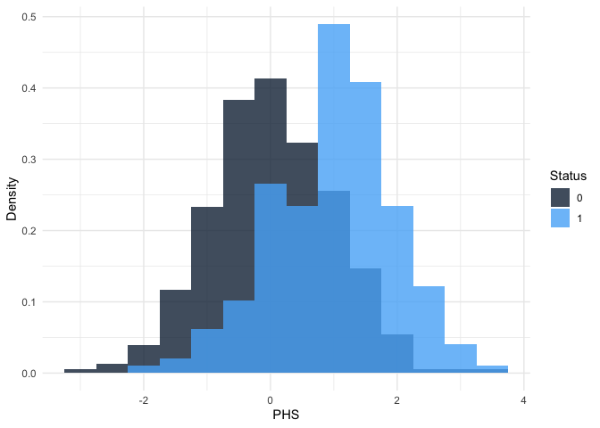

hazRd
================

The goal of hazRd is to simplify and standardize the development and
testing of polygenic hazard score models.

## Installation

You can install the development version of hazRd from
[GitHub](https://github.com/) with:

``` r
devtools::install_github("amorris28/hazRd")
```

## Getting Started

First, generate some test data.

``` r
library(hazRd)
set.seed(49942138)

n = 1000
status = rbinom(n, 1, 0.2)

test_data = data.frame(id = as.factor(seq_len(n)),
                       phs  = rnorm(n) + (1 * status),
                       status = status,
                       age = sample(60:100, n, replace = TRUE))
```

Next, plot the histogram of PHSes by case/control status.

``` r
phs_hist(test_data, normalize = TRUE)
```

<!-- -->

Finally, calculate the hazard ratio comparing the mean of the top 20% of
PHSes to the mean of the bottom 20% (i.e., `HR80_20`).

``` r
HR80_20 = get_hr("phs", "age", "status", data = test_data)
```

## Developer Instructions

These are general instructions for how to create and document an R
package.

``` r
install.packages(c("usethis", "devtools", "roxygen2"))
```

First, navigate to where you want to create the R package project
directory. Open up an `R` console and run the `create_package` command.
The first argument will be the name of the package and the name of the
directory that is created within your current working directory.

``` r
usethis::create_package("my_package")
```

Next, navigate to your package directory (`cd my_package`) and develop
your package by adding code to the `R/` directory. Here is a simple
example of how to structure an `.R` script within the `R/` directory
called `my_function.R`.

``` r
#' This is the Title of the Help Page for my_function
#'
#' This is a description of what this function does.
#'
#' @param x Description of what the "x" parameter expects, default value, whether it is optional
#' @param y Description of what the "y" parameter expects, etc.
#' @return Description of what this function returns
#' @examples
#' my_results <- my_function(x = 1, y = 2)
#' @export
my_function <- function(x, y) {
 # Some code
}
```

Once you have created some files in the `R/` directory, you can
automatically generate documentation using either `roxygen2::roxygenise`
or `devtools::document`. `document` is generally preferred and actually
calls `roxygenise` as part of its testing. You can either call it
without any arguments from the root directory of your R package or you
can specify the path to the package as the first argument.

``` r
devtools::document("path_to_your_package")
```

Now, you can install the package locally using `devtools`.

``` r
devtools::install("path_to_your_package")
```
