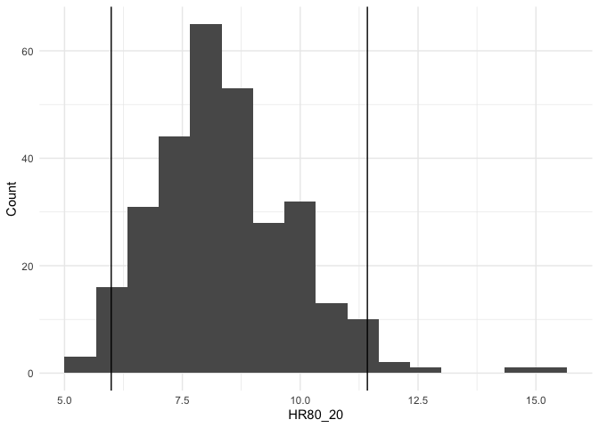
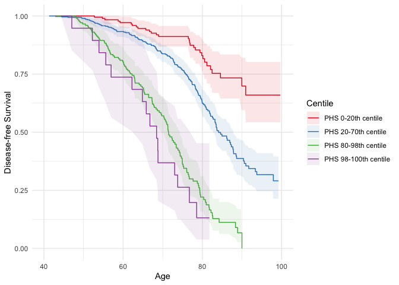

hazrd
================

<!-- badges: start -->

[](https://github.com/amorris28/hazRd/actions/workflows/R-CMD-check.yaml)
<!-- badges: end -->

The goal of hazrd is to simplify and standardize the development and
testing of polygenic hazard score models in an opinionated way based
mainly on past work in the [PHS
repo](https://github.com/cmig-research-group/phs). Currently, most of
the functionality focuses on external validation of PHS models. This
includes calculation of standard statistics (80-20 hazard ratios, 80-20
odds ratios, and concordance index) and plotting of Kaplan-Meier curves
and cumulative incidence curves. In the future, this will be expanded to
model development, internal validation, imaging risk scores, multimodal
hazard scores, and functions related to Digital Avatar.

## Installation

You can install the development version of hazrd from
[GitHub](https://github.com/) by cloning the repository:

``` bash
git clone git@github.com:amorris28/hazrd.git
```

and then opening `R` and installing the package:

``` r
devtools::install("hazrd")
```

Replace `"hazrd"` with the path to the repository on your local
computer.

Alternatively, you can clone the repo and then build a tar ball:

``` r
devtools::build("hazrd")
```

You can then import the resulting `.tar.gz` file to a remote cluster,
such as TSD. And install it with:

``` r
install.packages("hazrd_0.1.0.tar.gz", repos = NULL, type="source")
```

## Getting Started

First, generate some test data. Here, we are using a simulated dataset
that is included with the `hazrd` package.

``` r
library(ggplot2)
library(hazrd)
set.seed(4649580)

head(test_data)
```

    ##          phs      age status
    ## 1  1.2959195 61.20479      0
    ## 2  0.7677172 52.15337      0
    ## 3  1.8747000 56.05307      0
    ## 4 -1.0106221 81.71140      0
    ## 5 -0.7239738 61.37459      0
    ## 6 -1.2076723 54.56741      0

Next, plot the histogram of PHSes by case/control status.

``` r
phs_hist(test_data, normalize = TRUE)
```

<!-- -->

Then, calculate the hazard ratio comparing the mean of the top 20% of
PHSes to the mean of the bottom 20% (i.e., `HR80_20`). We can also
generate 95% confidence intervals using bootstrapping.

``` r
HR80_20 = get_hr(test_data, CI = TRUE, boot = 300)
str(HR80_20)
```

    ## List of 5
    ##  $ index    : chr "HR80_20"
    ##  $ value    : num 7.34
    ##  $ conf.low : num 5.1
    ##  $ conf.high: num 11
    ##  $ iters    : num [1:300, 1] 8.06 6.28 9.3 11.93 4.92 ...

Each `get_` function also returns the output from each bootstrap
iteration in `$iters` so that the user can plot these or calculate their
own confidence intervals:

``` r
ggplot(mapping = aes(x = HR80_20$iters)) +
    geom_histogram(binwidth = 2/3) +
    geom_vline(xintercept = HR80_20$HR, color = "red") +
    geom_vline(xintercept = HR80_20$conf.low) +
    geom_vline(xintercept = HR80_20$conf.high) +
        theme_minimal() +
        labs(x = "HR80_20", y = "Count")
```

<!-- -->

Similarly, calculate the odds ratio at age 70 between the top 20% and
bottom 20% of PHSes.

``` r
OR80_20 = get_or(test_data, or_age = 70, CI = TRUE, boot = 300)
str(OR80_20)
```

    ## List of 5
    ##  $ index    : chr "OR80_20"
    ##  $ value    : num 4.86
    ##  $ conf.low : num 2.81
    ##  $ conf.high: num 12.9
    ##  $ iters    : num [1:300, 1] 3.23 4.41 3.41 17.88 4.01 ...

``` r
ggplot(mapping = aes(x = OR80_20$iters)) +
    geom_histogram(binwidth = 3/2) +
    geom_vline(xintercept = OR80_20$OR, color = "red") +
    geom_vline(xintercept = OR80_20$conf.low) +
    geom_vline(xintercept = OR80_20$conf.high) +
        theme_minimal() +
        labs(x = "OR80_20", y = "Count")
```

<!-- -->

Return the concordance index with 95% confidence intervals from a coxph
fit:

``` r
c_index = get_cindex(test_data, CI = TRUE, boot = 300)
str(c_index)
```

    ## List of 5
    ##  $ index    : chr "C_Index"
    ##  $ value    : num 0.671
    ##  $ conf.low : num 0.624
    ##  $ conf.high: num 0.708
    ##  $ iters    : num [1:300, 1] 0.668 0.669 0.665 0.654 0.703 ...

Finally, plot the Kaplan-Meier curves with confidence intervals for
centiles of interest.

``` r
curves = data.frame(curve0_20 = c(0,   0.2),
                    curve20_70 = c(0.2, 0.7),
                    curve80_98 = c(0.8, 0.98),
                    curve98_100 = c(0.98, 1.0))

label_generator = function(x, y) {
    x = x * 100
    y = y * 100
    out = paste0("PHS ", x, "-", y, "th centile")
    return(out)
}

km_curves = data.frame()
for (i in seq_len(length(curves))) {
    curven <- km_curve(data = test_data,  
                       interval = curves[[i]],
                       age_range = 40:100, 
                       scale = FALSE, 
                       inverse = FALSE)
    curven$label = label_generator(curves[1, i], curves[2, i])
    km_curves = rbind(km_curves, curven)
}


ggplot(km_curves, aes(x = time, 
                      y = estimate,
                      ymin = conf.low,
                      ymax = conf.high,
                      col = label,
                      fill = label)) +
    geom_ribbon(alpha = 0.1,
                color = 0) +
    geom_step() +
    theme_minimal() +
    xlim(40, 100) + 
    ylim(0, 1) +
    labs(x = "Age", y = "Disease-free Survival") +
    scale_color_brewer(palette = "Set1",
                       name = "Centile") +
    scale_fill_brewer(palette = "Set1",
                       name = "Centile")
```

<!-- -->

## Developer Instructions

These are general instructions for how to create and document an R
package.

``` r
install.packages(c("usethis", "devtools", "roxygen2"))
```

First, navigate to where you want to create the R package project
directory. Open up an `R` console and run the `create_package` command.
The first argument will be the name of the package and the name of the
directory that is created within your current working directory.

``` r
usethis::create_package("my_package")
```

Next, navigate to your package directory (`cd my_package`) and develop
your package by adding code to the `R/` directory. Here is a simple
example of how to structure an `.R` script within the `R/` directory
called `my_function.R`.

``` r
#' This is the Title of the Help Page for my_function
#'
#' This is a description of what this function does.
#'
#' @param x Description of what the "x" parameter expects, default value, whether it is optional
#' @param y Description of what the "y" parameter expects, etc.
#' @return Description of what this function returns
#' @examples
#' my_results <- my_function(x = 1, y = 2)
#' @export
my_function <- function(x, y) {
 # Some code
}
```

Once you have created some files in the `R/` directory, you can
automatically generate documentation using either `roxygen2::roxygenise`
or `devtools::document`. `document` is generally preferred and actually
calls `roxygenise` as part of its testing. You can either call it
without any arguments from the root directory of your R package or you
can specify the path to the package as the first argument.

``` r
devtools::document("path_to_your_package")
```

To verify there are no errors in the code or documentation, you can run
`check`:

``` r
devtools::check()
```

There is a [known
bug](https://stackoverflow.com/questions/63613301/r-cmd-check-note-unable-to-verify-current-time)
where `check` returns 1 Note that says “unable to verify current time”.
The workaround is to add `_R_CHECK_SYSTEM_CLOCK_=0` to your R
environment file:

``` r
usethis::edit_r_environ()
```

Resolve this and any other Errors, Warnings, and Notes that come up from
`check`.

Finally, you can install the package locally using `devtools`:

``` r
devtools::install("path_to_your_package")
```
