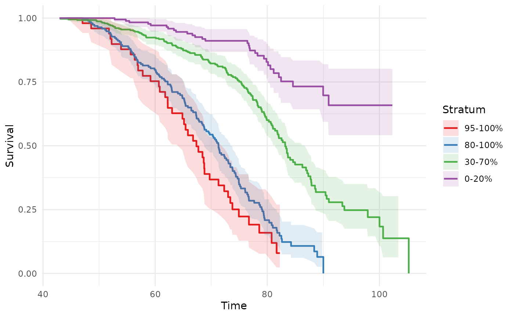
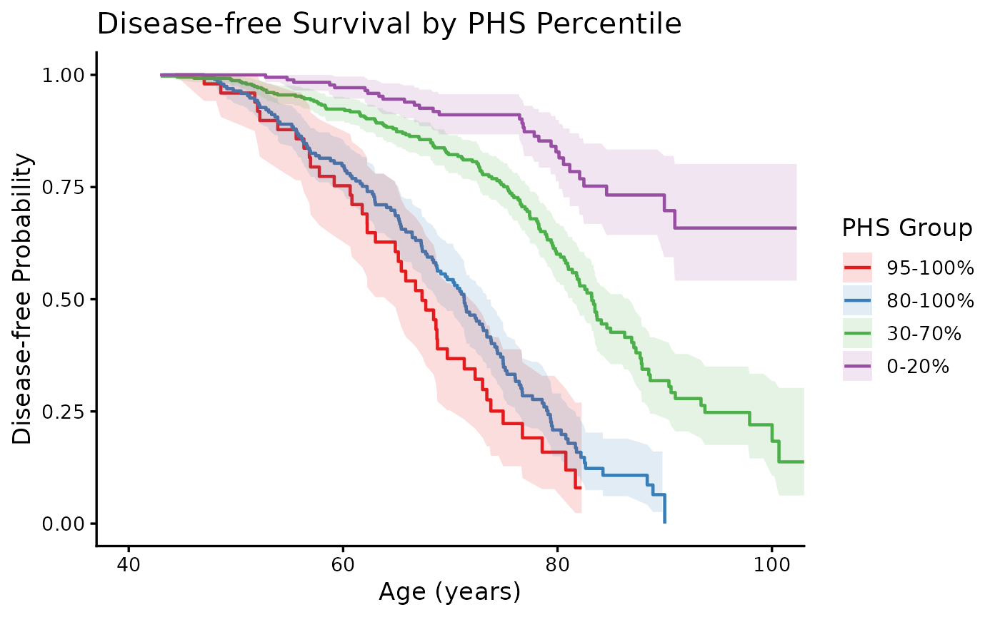
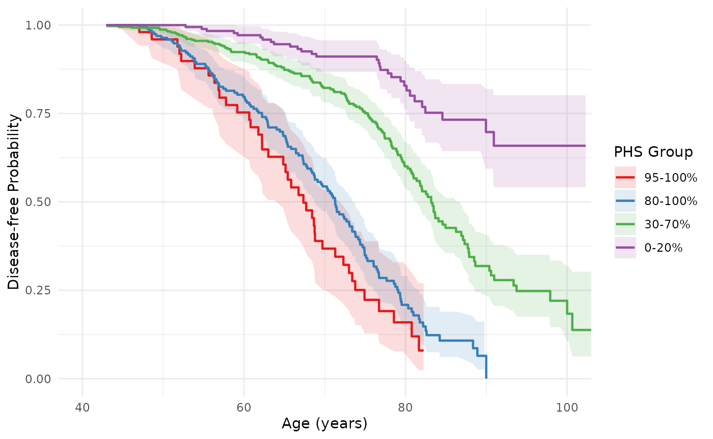
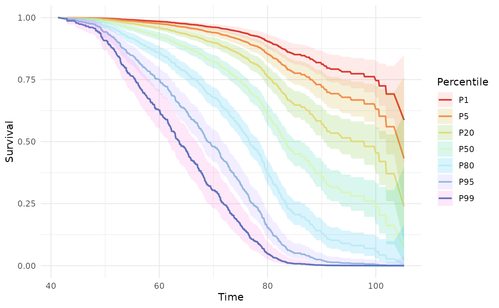
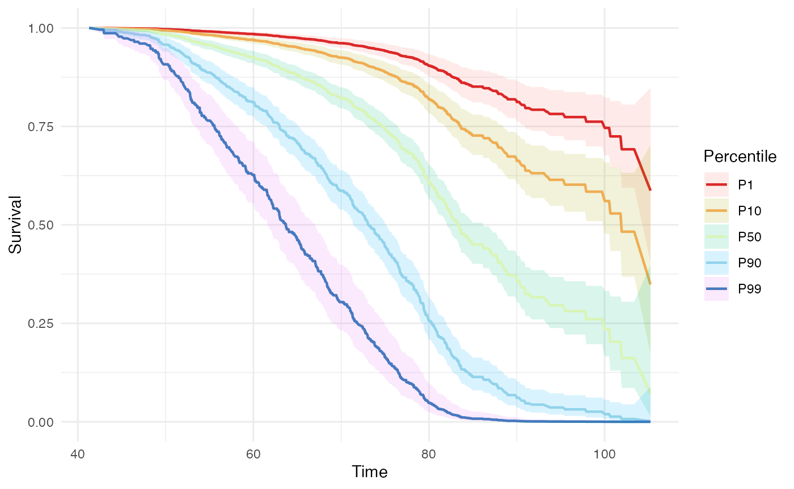

# Getting started with hazrd

``` r
library(hazrd)
library(ggplot2)
```

`hazrd` provides a consistent API for computing survival-based
discrimination metrics and visualizing Kaplan-Meier curves stratified by
polygenic hazard score (PHS). The primary user-facing functions are
[`phs_metrics()`](https://amorris28.github.io/hazrd/reference/phs_metrics.md)
for statistics,
[`phs_km_curve()`](https://amorris28.github.io/hazrd/reference/phs_km_curve.md)
for Kaplan-Meier plots, and
[`phs_cox_curve()`](https://amorris28.github.io/hazrd/reference/phs_cox_curve.md)
for Cox model-based survival curves at specified PHS percentiles.

## Data

The package ships with a simulated survival dataset, `test_data`. The
three required columns are `phs` (continuous score), `age` (time to
event or censoring), and `status` (event indicator: 1 = event, 0 =
censored).

Here is our test data included in the package.

``` r
head(test_data)
#>          phs      age status
#> 1  0.8425735 67.95011      1
#> 2  1.1151321 56.31356      0
#> 3 -0.3777455 72.94103      1
#> 4  0.1201511 82.01571      1
#> 5 -0.4041602 74.33629      1
#> 6 -0.4531890 77.15814      1
```

## Computing metrics with `phs_metrics()`

[`phs_metrics()`](https://amorris28.github.io/hazrd/reference/phs_metrics.md)
is the single entry point for all discrimination statistics. It fits a
Cox proportional hazards model and derives metrics from the fit. The
`metrics` argument controls which statistics are computed; column names
are passed as strings and default to `"phs"`, `"age"`, and `"status"`.

### All core metrics in one call

``` r
metrics <- phs_metrics(
  test_data,
  metrics  = c("HR", "C_index", "OR", "HR_SD"),
  or_age   = 70
)
metrics
#> # A tibble: 4 × 9
#>   metric      estimate conf_low conf_high    se n_numerator n_denominator method
#>   <chr>          <dbl>    <dbl>     <dbl> <dbl>       <int>         <int> <chr> 
#> 1 HR[80-100]…    8.17        NA        NA    NA         200           200 conti…
#> 2 C_index        0.708       NA        NA    NA          NA            NA harre…
#> 3 HR_SD          2.12        NA        NA    NA          NA            NA NA    
#> 4 OR[80-100]…    8.52        NA        NA    NA         200           200 NA    
#> # ℹ 1 more variable: adjusted <lgl>
```

The returned tibble has one row per metric. `conf_low`, `conf_high`, and
`se` are `NA` until bootstrapping is enabled.

### Hazard ratio

By default
[`phs_metrics()`](https://amorris28.github.io/hazrd/reference/phs_metrics.md)
computes `HR[80-100]_[0-20]` — the ratio of the top 20% to the bottom
20% of the PHS distribution. Use `hr_numerator` / `hr_denominator` to
change the bands:

``` r
phs_metrics(test_data, metrics = "HR", hr_numerator = 0.90, hr_denominator = 0.10)
#> # A tibble: 1 × 9
#>   metric      estimate conf_low conf_high    se n_numerator n_denominator method
#>   <chr>          <dbl>    <dbl>     <dbl> <dbl>       <int>         <int> <chr> 
#> 1 HR[90-100]…     13.7       NA        NA    NA         100           100 conti…
#> # ℹ 1 more variable: adjusted <lgl>
```

For multiple HRs in one call, supply `hr_pairs`:

``` r
phs_metrics(
  test_data,
  metrics  = "HR",
  hr_pairs = list(
    list(numerator = c(0.80, 1.00), denominator = c(0.00, 0.20)),
    list(numerator = c(0.80, 1.00), denominator = c(0.40, 0.60))
  )
)
#> # A tibble: 2 × 9
#>   metric      estimate conf_low conf_high    se n_numerator n_denominator method
#>   <chr>          <dbl>    <dbl>     <dbl> <dbl>       <int>         <int> <chr> 
#> 1 HR[80-100]…     8.17       NA        NA    NA         200           200 conti…
#> 2 HR[80-100]…     3.05       NA        NA    NA         200           200 conti…
#> # ℹ 1 more variable: adjusted <lgl>
```

### Odds ratio

The OR is computed from Kaplan-Meier survival estimates at a specific
age. `or_age` accepts a vector; one row is returned per age:

``` r
phs_metrics(test_data, metrics = "OR", or_age = c(65, 70, 75))
#> # A tibble: 3 × 9
#>   metric      estimate conf_low conf_high    se n_numerator n_denominator method
#>   <chr>          <dbl>    <dbl>     <dbl> <dbl>       <int>         <int> <chr> 
#> 1 OR[80-100]…     8.22       NA        NA    NA         200           200 NA    
#> 2 OR[80-100]…     8.52       NA        NA    NA         200           200 NA    
#> 3 OR[80-100]…    19.1        NA        NA    NA         200           200 NA    
#> # ℹ 1 more variable: adjusted <lgl>
```

### Bootstrapped confidence intervals

Set `bootstrap = TRUE` to populate `conf_low`, `conf_high`, and `se`.
Use a small `n_boot` for speed during development:

``` r
phs_metrics(
  test_data,
  metrics   = c("HR", "C_index", "HR_SD"),
  bootstrap = TRUE,
  n_boot    = 300,
  seed      = 42
)
#> # A tibble: 3 × 9
#>   metric     estimate conf_low conf_high     se n_numerator n_denominator method
#>   <chr>         <dbl>    <dbl>     <dbl>  <dbl>       <int>         <int> <chr> 
#> 1 HR[80-100…    8.17     5.93     11.8   1.36           200           200 conti…
#> 2 C_index       0.708    0.680     0.734 0.0139          NA            NA harre…
#> 3 HR_SD         2.12     1.90      2.42  0.124           NA            NA NA    
#> # ℹ 1 more variable: adjusted <lgl>
```

### Non-default column names

Column names are passed as strings, making
[`phs_metrics()`](https://amorris28.github.io/hazrd/reference/phs_metrics.md)
straightforward to use with non-standard data frames:

``` r
test_data2 <- with(test_data, data.frame(
  score     = phs,
  diagnosis_age = age,
  case      = status
))

phs_metrics(
  test_data2,
  phs   = "score",
  time  = "diagnosis_age",
  event = "case",
  metrics = c("HR", "C_index")
)
#> # A tibble: 2 × 9
#>   metric      estimate conf_low conf_high    se n_numerator n_denominator method
#>   <chr>          <dbl>    <dbl>     <dbl> <dbl>       <int>         <int> <chr> 
#> 1 HR[80-100]…    8.17        NA        NA    NA         200           200 conti…
#> 2 C_index        0.708       NA        NA    NA          NA            NA harre…
#> # ℹ 1 more variable: adjusted <lgl>
```

## Kaplan-Meier curves with `phs_km_curve()`

[`phs_km_curve()`](https://amorris28.github.io/hazrd/reference/phs_km_curve.md)
stratifies the cohort into percentile bands and plots empirical
Kaplan-Meier survival curves for each band. It returns either a `ggplot`
object (`output = "plot"`, the default) or a tidy data frame
(`output = "data"`).

### Default plot

The default `breaks = c(0.20, 0.80)` splits the cohort into bottom 20%,
middle 60%, and top 20%:

``` r
phs_km_curve(test_data)
#> Warning: Removed 2 rows containing missing values or values outside the scale range
#> (`geom_ribbon()`).
```



### Custom cutpoints

Pass any numeric vector of percentile cutpoints (strictly in (0, 1)) to
`breaks`:

``` r
# Quintiles
phs_km_curve(test_data, breaks = c(0.20, 0.40, 0.60, 0.80))
#> Warning: Removed 2 rows containing missing values or values outside the scale range
#> (`geom_ribbon()`).
```


### Modifying the ggplot output

[`phs_km_curve()`](https://amorris28.github.io/hazrd/reference/phs_km_curve.md)
returns a standard `ggplot` object that can be extended with any ggplot2
layers, themes, or scales:

``` r
phs_km_curve(test_data) +
  theme_classic(base_size = 13) +
  labs(
    title = "Disease-free Survival by PHS Percentile",
    x     = "Age (years)",
    y     = "Disease-free Probability",
    color = "PHS Group",
    fill  = "PHS Group"
  ) +
  coord_cartesian(xlim = c(40, 100))
#> Warning: Removed 2 rows containing missing values or values outside the scale range
#> (`geom_ribbon()`).
```



### Getting the underlying data

Use `output = "data"` when you want to build a fully custom plot or pass
the survival estimates on to further analysis:

``` r
km_data <- phs_km_curve(test_data, output = "data")
head(km_data)
#>       time  estimate  conf.low conf.high n.risk n.event stratum
#> 1 44.30748 1.0000000 1.0000000 1.0000000     51       0 95-100%
#> 2 47.04070 0.9800000 0.9419529 1.0000000     50       1 95-100%
#> 3 48.14581 0.9800000 0.9419529 1.0000000     49       0 95-100%
#> 4 48.58741 0.9595833 0.9062444 1.0000000     48       1 95-100%
#> 5 51.75902 0.9391667 0.8747578 1.0000000     47       1 95-100%
#> 6 52.01547 0.9187500 0.8454998 0.9983463     46       1 95-100%
```

The returned data frame has columns `time`, `estimate`, `conf.low`,
`conf.high`, `n.risk`, `n.event`, and `stratum`, which can be used
directly with ggplot2:

``` r
ggplot(km_data, aes(x = time, y = estimate,
                    ymin = conf.low, ymax = conf.high,
                    color = stratum, fill = stratum)) +
  geom_ribbon(alpha = 0.15, color = NA) +
  geom_step(linewidth = 0.8) +
  scale_color_brewer(palette = "Set1", name = "PHS Group") +
  scale_fill_brewer(palette = "Set1", name = "PHS Group") +
  coord_cartesian(xlim = c(40, 100), ylim = c(0, 1)) +
  labs(x = "Age (years)", y = "Disease-free Probability") +
  theme_minimal()
#> Warning: Removed 2 rows containing missing values or values outside the scale range
#> (`geom_ribbon()`).
```



## Cox model curves with `phs_cox_curve()`

[`phs_cox_curve()`](https://amorris28.github.io/hazrd/reference/phs_cox_curve.md)
fits a Cox proportional-hazards model (`phs` as the sole predictor) and
returns predicted survival curves for individuals at specified PHS
percentiles. Unlike
[`phs_km_curve()`](https://amorris28.github.io/hazrd/reference/phs_km_curve.md),
these are smooth model-based predictions, not empirical group estimates.

``` r
phs_cox_curve(test_data)
```



Supply specific percentiles via the `percentiles` argument:

``` r
phs_cox_curve(test_data, percentiles = c(0.01, 0.10, 0.50, 0.90, 0.99))
```


